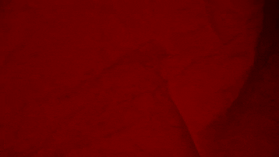
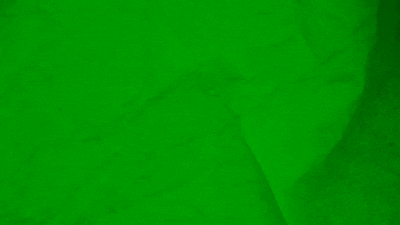
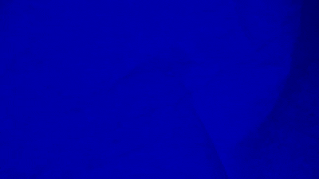

# Video to Frames and Grayscale Conversion

This project converts an RGB video into individual frames and generates grayscale versions of those frames to analyze intensity. The code is implemented in Python using OpenCV and NumPy.

## Prerequisites

- Dependencies listed in `requirements.txt`
- then `conda install ffmpeg` or follow installation

## Installation

1. Clone the repository:
   ```bash
   git clone https://github.com/FaIhAjAlAmToPu/opencv-video-channels.git
   cd opencv-video-channels
   ```
2. Create a virtual environment and activate it:
    ```bash
   conda env create -f environment.yml
   conda activate opencv
   ```

## Project Structure

- `requirements.txt`: Lists Python dependencies (e.g., opencv-python, numpy).
- `channels/`: Python scripts to process the video and save separate channel frames.
- `resources/`: all the videos and gifs

## Usage

1. Place your input video file (e.g., `rgb.mp4`) in the `resources/` directory.
2. Run the script to see grayscale frames of separate channels
   ```bash
   python channels\main.py
   ```
3. Run the script to save grayscale frames of separate channels in the `resources/` directory.
   ```bash
      python channels\show_channel_intensity.py
      ```
3. Run the script to save colored frames of separate channels in the `resources/` directory.
   ```bash
      python channels\show_channel_colors.py
      ```
   
## Input
 
## Output Examples

The following table showcases the RGB video, individual color channels, and their grayscale intensities generated from a sample video:

| Red Channel                    | Green Channel                      | Blue Channel                     |
|--------------------------------|------------------------------------|----------------------------------|
|  |  |  |

| Grayscale Red                                      | Grayscale Green                                        | Grayscale Blue                                       |
|----------------------------------------------------|--------------------------------------------------------|------------------------------------------------------|
|  |  |  |
